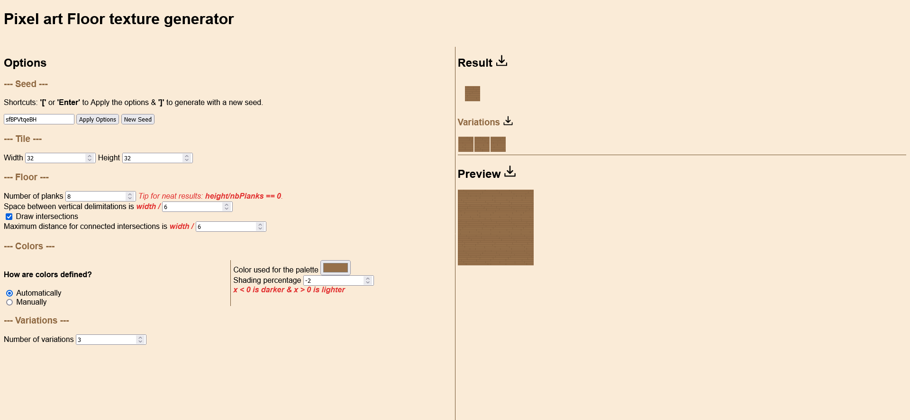
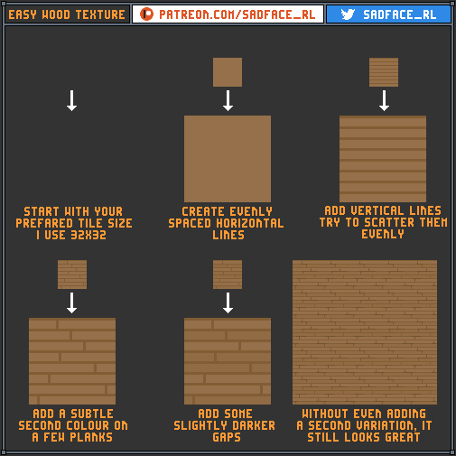

# Floor texture generator

## Demo
You can play with it **[➡️➡️ here ⬅️⬅️](https://codepen.io/Shaigro/full/dyzgNYZ)**.

## How?
This generator is heavily inspired from the tutorial made by [@Sadface_RL](https://twitter.com/Sadface_RL):  

The main difference is that I draw in this order:
1. Light and dark planks
2. Horizontal lines
3. Vertical lines
4. Intersections

## Libs
I'm using seedrandom.js for `Math.random(seed)` and Konva.js for a faster easier use of the Canvas API.

## Options

### Seed

1. Specify the seed you want to use.
2. With `Apply Options`, apply the new options to the current generation.  
   This is what you want to use to generate with a seed you specified.
3. With `New Seed`, generate a new floor texture with a random seed.

You can also use shortcuts:
1. `[` or `Enter` will `Apply Options`
2. `]` will do the same as `New Seed`

### Canvas
1. Change the width of the canvas/image.
2. Change the height of the canvas/image.

### Planks
1. Change the number of planks of the floor texture.  
   You want to have **(canvas height / number of planks) == 0** for a good looking result.
2. Change the space between vertical delimitations.  
   This is computed using the canvas width.  
   I advise to stay between **4** and **8**. Otherwise, you will either end up with the same results, either bad looking results *most of the time*.
3. Enable/disable intersections drawing.  
   Sometimes you get really interesting variations but the intersections are no good.
4. Change the maximum distance for connected intersections.  
   This is computed using the canvas width.  
   This determines whether intersections on the same row should be connected or not.

### Colors
You can either define the colors used manually or automatically.

#### Automatically
1. Chose the color for the lightest plank.  
   The other colors will be generated from this one.
2. Chose the shading percentage.  
   This determine how dark/light the darker planks, the delimitations and the intersections are.  
   **Positive values result in lightening the colors and negative values result in darkening the colors.**

### Manually
1. Chose the color for the lighter planks.
2. Chose the color for the darker planks.
3. Chose the color for the delimitations between planks.
4. Chose the color for the intersections.

### Variations
1. Chose the number of variations that will be generated.

## Results
On the right side of the page, you have the result, the variations and the preview.

### Result
The base result determine where the base and darker planks are placed.

You can download the result. It will download it under the name `result-<seed>.png` with "seed" being the seed used.

### Variations
The variations use the darker planks placement.

You can download the variations. It will download them under the names `variations-<number>-<seed>.png` with "number" being the relevant variation and "seed" being the seed used.

*N.B.: Technically speaking, it's not really a variation. Just another generation using the same light & dark planks.*

### Preview
The preview is a mix of the result and the variations pasted multiple times.

You can download the preview. It will download it under the name `preview-<seed>.png` with "seed" being the seed used.